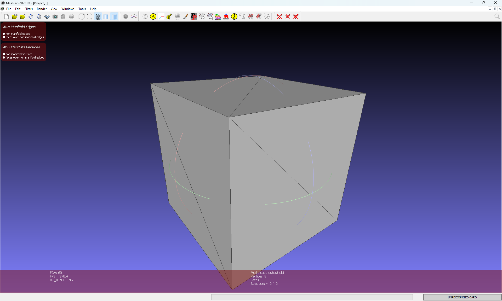
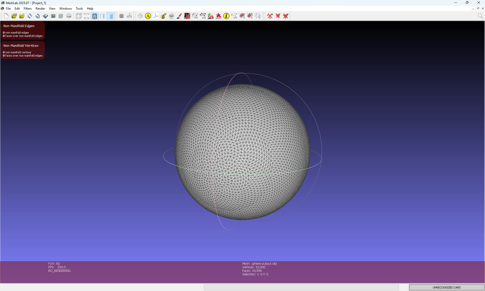
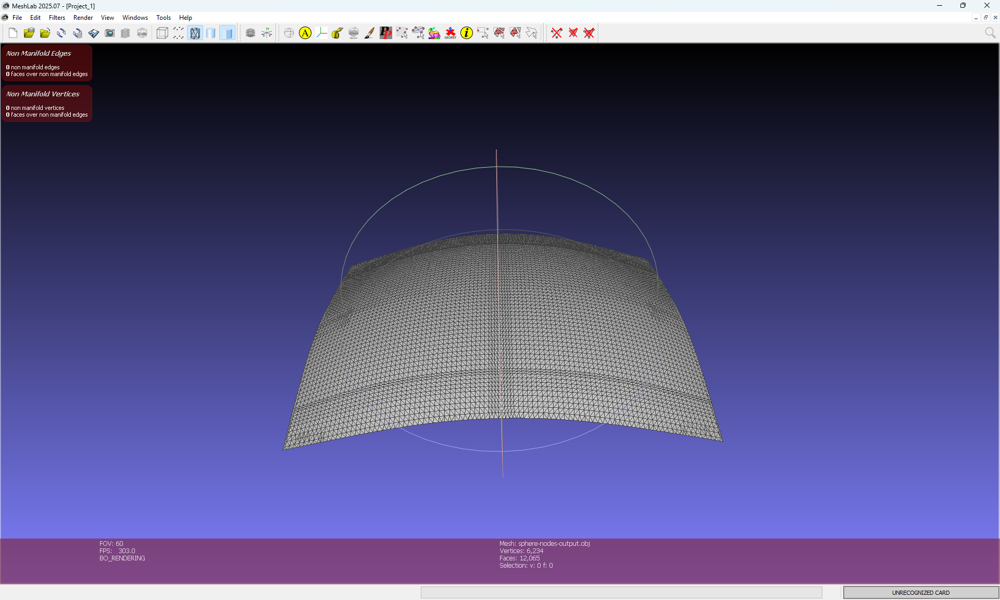
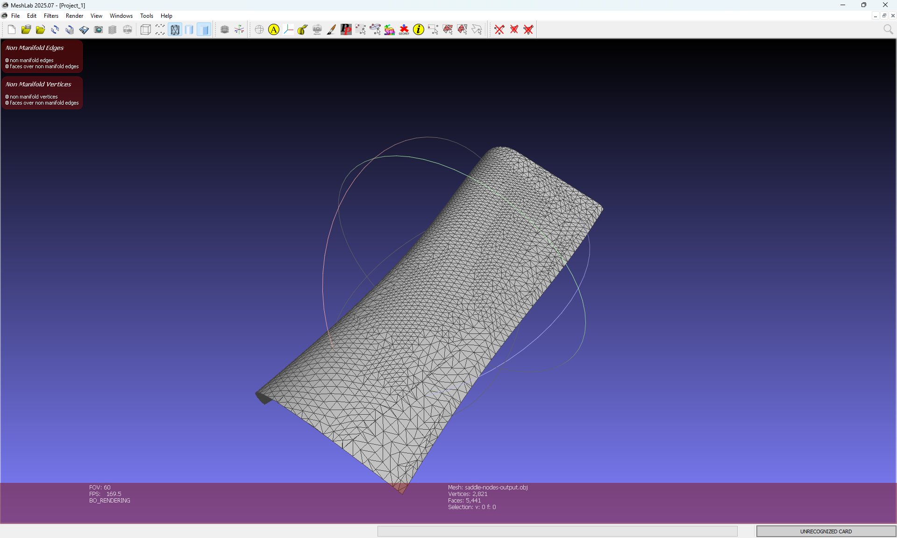
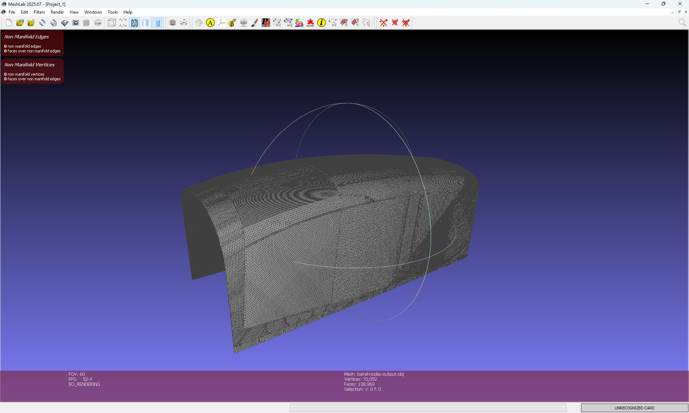

# Point Cloud Triangulation (Ball Pivoting Algorithm)

Этот проект представляет собой реализацию алгоритма **Ball Pivoting Algorithm (BPA)** для реконструкции треугольной сетки (mesh) из неструктурированного облака точек на языке C++20.

## Описание алгоритма

Алгоритм "катящегося шара" (Ball Pivoting Algorithm, Bernardini et al., 1999) работает по следующей логике:
1. Виртуальная сфера заданного радиуса $R$ перекатывается по поверхности, восстанавливаемой из облака точек.
2. Когда сфера одновременно касается **трех точек** и не содержит внутри себя никаких других точек (критерий пустой сферы), между этими точками создается треугольник.
3. Алгоритм начинает с поиска начального корректного треугольника (seed), проверяя согласованность нормалей, геометрическую корректность и критерий пустой сферы.
4. Затем он итеративно наращивает поверхность, перекатывая сферу через ребра текущего "фронта" (boundary edges), выбирая новую вершину, для которой угол поворота шара минимален.
5. Нормали точек вычисляются методом PCA по локальной окрестности и затем глобально ориентируются относительно центра масс облака. Полученные нормали используются при выборе начального треугольника и обеспечении согласованной ориентации поверхности.

## Структура репозитория

```
├── CMakeLists.txt               # Конфигурация сборки (автоматически загружает зависимости)
├── src/                         # Исходный код ядра программы
│   ├── main.cpp                 # Точка входа, парсинг аргументов командной строки
│   ├── geometry.h               # Базовые математические типы (Point, Vector3) и операции
│   ├── ball_pivoting.{cpp,h}    # Основная логика алгоритма BPA
│   ├── kd_tree.{cpp,h}          # KD-дерево для поиска ближайших соседей и радиусного поиска
│   ├── normal_estimator.{cpp,h} # Оценка нормалей методом PCA
│   ├── preprocessor.{cpp,h}     # Предобработка: удаление дубликатов точек
│   ├── file_parser.{cpp,h}      # Чтение (.xyz) и запись (.txt, .obj) файлов
│   ├── config.{cpp,h}           # Парсинг параметров из JSON-файла
│   └── eigen33.{cpp,h}          # Вычисление собственных значений и векторов матрицы 3x3
├── tests/                       # Юнит и интеграционные тесты (фреймворк Catch2)
├── config.json                  # Параметры алгоритма
└── README.md                    # Этот файл
```

## Параметры конфигурации

Основные параметры алгоритма задаются в `config.json`.

| Параметр | Назначение |
|----------|------------|
| radius_multiplier | множитель среднего расстояния между соседями для вычисления радиуса шара |
| max_edge_multiplier | максимальная допустимая длина ребра |
| pca_neighbors | число соседей для оценки нормалей методом PCA |
| duplicate_tolerance | допуск при удалении совпадающих точек |
| threads | число потоков OpenMP |
| export_obj | сохранять ли результат в формате OBJ |

## Требования и сборка

Для сборки проекта понадобятся:
- Компилятор C++ с поддержкой **C++20** (GCC 11+, Clang 13+, MSVC 2019+)
- **CMake** версии 3.14 или выше
- **Git**
- **OpenMP** (включен в GCC/Clang, опционален в MSVC)


Все внешние зависимости (`nlohmann/json`, `cxxopts`, `Catch2`) загружаются автоматически через `FetchContent` при первом запуске CMake. Интернет-соединение требуется только при первой сборке.

### Команды для сборки из командной строки

Для сборки необходимо выполнить следующие команды в терминале, находясь в корневой папке проекта:

```
# 1. Создать папку для сборки и перейдите в неё
mkdir build && cd build

# 2. Сконфигурировать проект с помощью CMake
cmake ..

# 3. Соберать проект (флаг -j 8 использует 8 потоков для ускорения сборки)
cmake --build . -j 8
```

## Запуск и аргументы командной строки

Основной исполняемый файл triangulator принимает следующие обязательные и опциональные флаги:

| Флаг | Описание | Пример |
| ---- | -------- | ------ |
| -i, --input | (Обязательно) Путь к входному файлу облака точек (.xyz) | -i cube.xyz |
| -o, --output | (Обязательно) Путь к выходному файлу сетки (.txt или .obj) | -o result.obj |
| -c, --config | (Опционально) Путь к файлу конфигурации (по умолчанию: config.json) | -c my_config.json |
| -h, --help | Вывод справки по использованию | -h |

## Команды для запуска
```
.\build\triangulator.exe -i data/sphere.xyz -o sphere-output.txt
.\build\triangulator.exe -i data/sphere-nodes.xyz -o sphere-nodes-output.txt
.\build\triangulator.exe -i data/saddle-nodes.xyz -o saddle-nodes-output.txt
.\build\triangulator.exe -i data/barrel-nodes.xyz -o barrel-nodes-output.txt
```

## Тестирование

Проект покрыт юнит- и интеграционными тестами (фреймворк Catch2). Для запуска:
`.\build\test_runner.exe`

## Визуализация результатов

Ниже представлены примеры успешно реконструированных треугольных сеток (mesh) для различных тестовых наборов данных. Визуализация выполнена в MeshLab:





